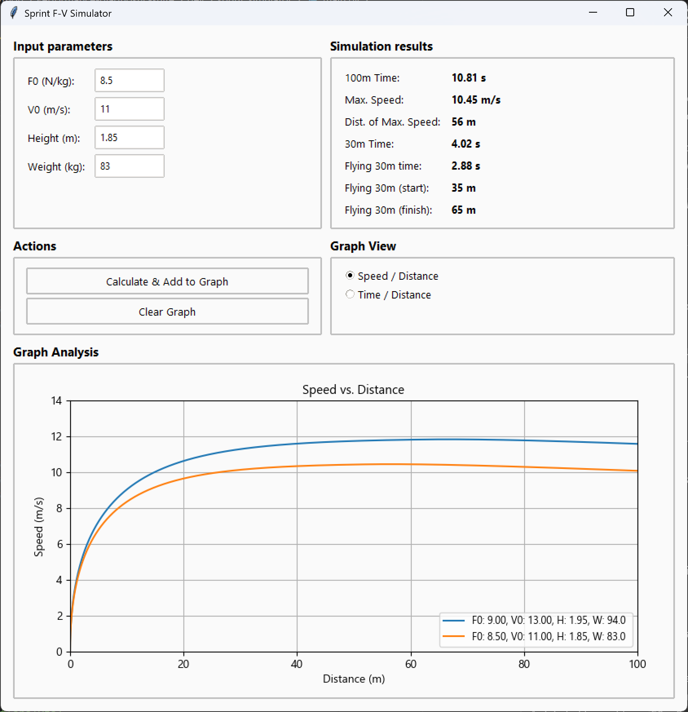

# 🏁 Sprint Simulator GUI

### About

This is the flagship desktop application of the **Performance-Diagnostic-Suite**. It's a lightweight tool, built with Python and Tkinter, designed for coaches, athletes, and sport scientists.

It allows you to run instant "what-if" scenarios to see how changes in an athlete's Force-Velocity profile (F0, V0) and body parameters (Weight, Height) will affect their sprint performance over 100 meters.

---

### GUI Overview




---

### 🚀 Quick Start (Download)

For most users, the easiest way to use the app is to download the pre-compiled version.

1.  Go to the [**Releases Page**](https://github.com/dankovac30/Performance-Diagnostic-Suite/releases).
2.  Download the latest `Sprint-F-V-Simulator.exe` file.
3.  Run the `.exe` file.

---

### ✨ Features

* **F-V Profile Inputs:** Analyze sprint performance based on `F0` (N/kg), `V0` (m/s), `Weight` (kg), and `Height` (m).
* **Key Performance Metrics:** Instantly see the results for:
    * 100m Time
    * Max Speed
    * Distance to Max Speed
    * 30m Time
    * Flying 30m Time (and its start/finish distance).
* **Interactive Graphing:**
    * Visualize the full performance curve.
    * Switch between **Speed vs. Distance** and **Time vs. Distance** views.
    * Plot multiple simulations on the same graph to directly compare different profiles.
    * A "Clear Graph" button lets you start a new analysis.


---

### 💻 Installation & Usage (from Source)

If you are a developer and want to run the app from the source code.

1.  **Clone the Repository:**
    ```bash
    git clone
    ```

2.  **Install Dependencies:**
    This app requires `matplotlib`, `pandas`, and `numpy`.
    ```bash
    pip install -r sprint_simulator_gui/requirements.txt
    ```

3.  **Run the Application:**
    The app **must** be run as a module from the **root** folder of the repository.
    ```bash
    python -m sprint_simulator_gui.app
    ```
---
### 🛠️ Tech Stack

* **Python 3**
* **Tkinter** (via `ttk`) for the GUI framework.
* **Matplotlib** for interactive data visualization.
* **PyInstaller** used for bundling the `.exe` release.